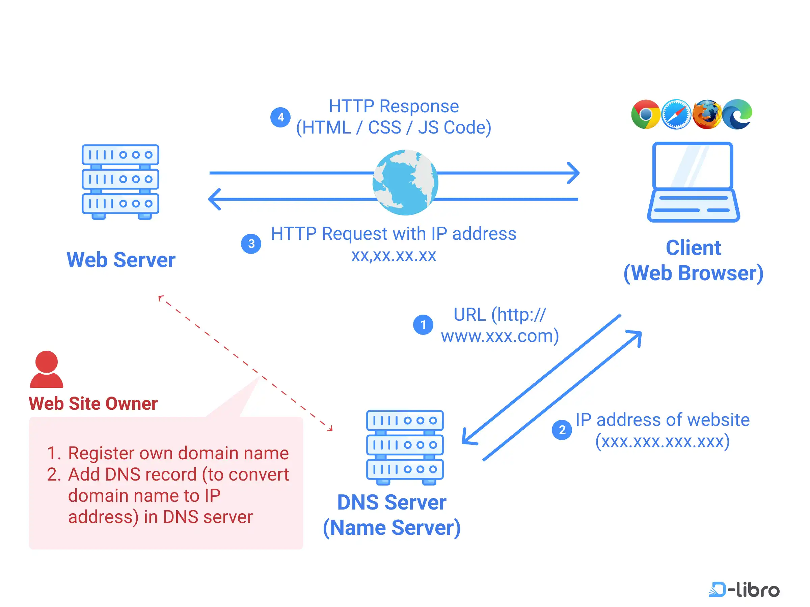

# IMCM-3BHK

## Einleitung

### Markdown

_Markdown_ ist eine Auszeichnungssprache (_Markup Language_). Mit Auszeichnungssprachen wird Text strukturiert. Einige Markup-Languages sind z.B.:

- HTML (_Hypertext Markup Language_)
- XML (_Extensible Markup Language_)
- MD (_Markdown_)
- YAML (_YAML Ain't Markup Language_ bzw. _Yet Another Markup Language_)

Markdown ist heutzutage eine der beliebtesten Auszeichnungssprachen. Wenn eine README.md-Datei in einem GitHub-Repository vorhanden ist, wird diese automatisch auf der Startseite des Repositories angezeigt. Die README.md-Datei ist also die erste Anlaufstelle für alle, die sich über das Projekt informieren möchten.

Um ein Git-Repository zu erstellen, sind folgende Schritte notwendig:

- im gewünschten Verzeichnis im Terminal (bzw. CLI - _Command Line Interface_) den Befehl `git init` ausführen

> **Einschub zur Installation von Git:**
> Falls bei der Eingabe von `git init` die Meldung _"command not found"_ erscheint, ist Git nicht installiert und der Befehl wird nicht erkannt. Bei der Installation wird der Befehl der Umgebungsvariabe **PATH** hinzugefügt. Darin sind die Bezeichnungen aller Programme enthalten, die im Terminal aufgerufen werden können.

- dann in GitHub-Desktop das lokale Repository hinzufügen (_File > Add Local Repository..._)
- nun kann über die Schaltflächen **Commit to master** und **Push origin** der aktuelle Stand des Projekts in das GitHub-Repository hochgeladen werden

## Statische und dynamische Websites

In den 1990er Jahren wurden Websites überwiegend statisch erstellt. Inhalte wurden als `html`-File auf einen Webserver hochgeladen. Bei jedem Aufruf der Website wurde das `html`-File vom Server an den Browser des Nutzers übertragen. Die Inhalte waren also immer gleich, unabhängig davon, wer die Website aufrief.

Die Abbildung zeigt die Funktionsweise von statischen Websites. Zuerst muss der Domain-Name über das Domain Name System (DNS) in die IP-Adresse des Webservers aufgelöst werden (Schritt 1 und 2 in der Abbildung). Danach schickt der Client eine http-Anfrage an den entsprechenden Webserver und erhält von diesem eine http-Antwort, die überlicherweise zuerst die `index.html`enthält (Schritt 3 und 4).

Ab den 2000er Jahren setzten sich zunehmend dynamische Websites durch. Bei dynamischen Websites werden die Inhalte nicht mehr als fertige `html`-Files auf den Webserver hochgeladen, sondern in einer Datenbank gespeichert. Bei jedem Aufruf der Website werden die Inhalte aus der Datenbank abgerufen und in ein `html`-File eingebettet, das dann an den Browser des Nutzers übertragen wird. Die Inhalte können also je nach Nutzer unterschiedlich sein.
